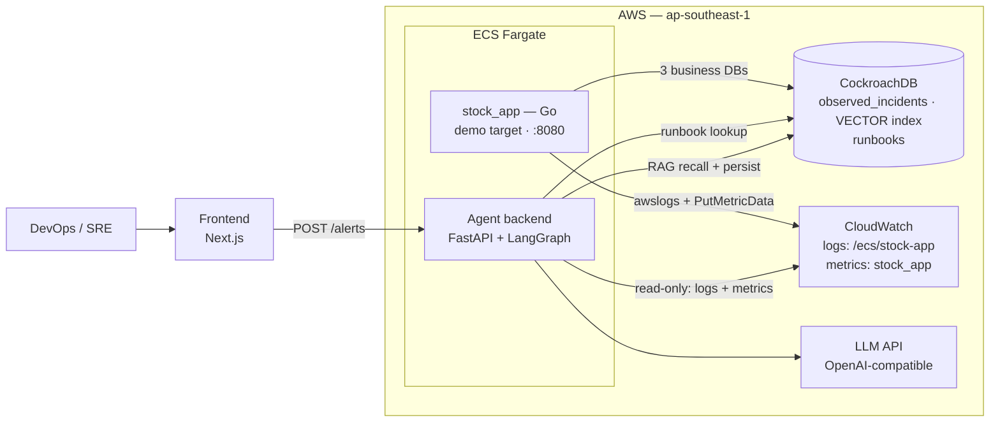

# Observe Bot
AI-powered incident investigation agent. When an alert arrives, the agent:

1. **Recalls** similar past incidents from long-term memory (CockroachDB vector RAG)
2. **Observes** the target app's live telemetry (CloudWatch logs + metrics)
3. **Analyzes** the incident with an LLM (OpenAI-compatible API)
4. **Decides** — run the matching **runbook** (only if known *and* safe), or **escalate to a human**
5. **Persists** the new knowledge, so the next similar incident is handled automatically

Both applications run on **AWS ECS Fargate** — the demo target app and the agent
backend are Fargate tasks. **CockroachDB** (cloud cluster) holds the agent's
long-term memory and runbook knowledge.

## Architecture (ECS)

> `Architecture.png` at the repo root is the **old V0 design** (API Gateway →
> Lambda → SQS → worker). It is superseded — the diagram below is canonical.



### Request path (V1)

```text
Alert → POST /alerts (FastAPI on ECS Fargate)
  → LangGraph agent loop (in-process):
       memory_check → observe → analyze → decide
                                                   ├→ run_runbook → persist_memory → END
                                                   └→ escalate ───→ persist_memory → END
```

| Node | What it does |
|---|---|
| `memory_check` | Semantic recall of past incidents (CockroachDB vector index) |
| `observe` | Fetches the target app's live CloudWatch logs + metrics |
| `analyze` | LLM reasons over alert text + recalled incidents + live telemetry |
| `decide` | Automates only when the incident is **known** (runbook match + prior memory) **and safe** (blast radius low/medium); otherwise escalates to a human |
| `run_runbook` | **Simulate-only in V1** — logs the steps, performs no real remediation |
| `persist_memory` | Embeds and stores the incident for future recall |

### Key decisions

- **ECS Fargate, no Lambda/SQS** — the old command-submission design is dropped.
  The agent backend is one FastAPI container; the multi-minute agent loop runs
  in-process inside the Fargate task. Pay-per-second: stop the task when the
  demo is over.
- **Hexagonal architecture (ports & adapters)** — agent nodes only call ports
  (`LLMPort`, `MemoryPort`, `RunbookPort`, `ObservabilityPort`); all AWS/DB/LLM
  clients live in `adapters/outbound/` (boto3, psycopg, openai). Enforced by
  `tests/unit/test_architecture.py`.
- **CockroachDB is the agent's shared memory** — vector index for semantic
  incident recall, plus a `runbooks` table. The same cluster also hosts the
  target app's three business databases (`target_app`, `stock_db`, `order_db`).
- **Observability degrades gracefully** — missing AWS credentials or empty
  telemetry yields empty evidence; the graph still runs.
- **Least-privilege IAM** — the agent identity needs only
  `logs:FilterLogEvents` + `cloudwatch:GetMetricStatistics` (read-only,
  resource-scoped); the target app needs `cloudwatch:PutMetricData`.
  Full policy: [agentic_app/README.md → IAM](apps/agent_app/agentic_app/README.md#iam-least-privilege-read-only).

## Monorepo Layout

```text
aws_cockroach/
├── README.md                    ← you are here (project overview + ECS architecture)
├── Architecture.png             ← old V0 (Lambda/SQS) diagram — historical only
└── apps/
    ├── agent_app/               ← the agent platform
    │   ├── agentic_app/         ← FastAPI + LangGraph agent (hexagonal)
    │   │   ├── README.md        ← V1 spec & implementation notes (source of truth for the agent)
    │   │   ├── src/             ← domain/ (ports + models) · agent/ (LangGraph nodes) · adapters/
    │   │   ├── migrations/      ← CockroachDB schema (observed_incidents, vector index, runbooks)
    │   │   └── tests/           ← unit (fakes, no I/O) + integration (live cluster + LLM)
    │   └── frontend_app/        ← Next.js frontend (placeholder for now)
    └── target_app/
        └── stock_app/           ← Go demo target, deployed to ECS Fargate
            ├── deploy.md        ← ECS Fargate deploy + CI/CD (GitHub Actions, OIDC)
            └── task-definition.json
```

The **agent platform** (`agent_app`) and the **demo target** (`target_app`) are
separate apps. The agent reads the target's logs and metrics read-only through
its `ObservabilityPort` (boto3 → CloudWatch) — it never touches the target
directly.

## Where to Start

- Agent V1 spec & implementation (request path, agent loop, RAG memory, runbooks, observability, IAM):
  [`apps/agent_app/agentic_app/README.md`](apps/agent_app/agentic_app/README.md)
- Target app ECS Fargate deployment (CI/CD, secrets, metrics):
  [`apps/target_app/stock_app/deploy.md`](apps/target_app/stock_app/deploy.md)
- CI/CD: [`.github/workflows/stock-app-deploy.yml`](.github/workflows/stock-app-deploy.yml)
  — deploys `stock_app` on push to `main` (test → build → ECR → run task)

## Run Locally

```bash
cd apps/agent_app/agentic_app
uv sync --extra dev
# .env needs: COCKROARCH_* (CockroachDB) + QWEN_* (LLM)  — see .env.example
# optional:  AWS_ACCESS_KEY_ID / AWS_SECRET_ACCESS_KEY / AWS_REGION (CloudWatch telemetry)

uv run uvicorn adapters.inbound.http.main:app --port 8000
```

```bash
# demo the decision logic (1st alert of a kind → escalate; 2nd → run_runbook)
curl -sX POST localhost:8000/alerts -H 'Content-Type: application/json' -d \
  '{"source":"grafana","incident_type":"connection pool exhaustion","summary":"payments service running out of database connections"}'
```

```bash
uv run --extra dev pytest -m unit         # fakes only — no network, no DB
uv run --extra dev pytest -m integration  # live CockroachDB cluster + LLM
```

> The env prefix is `COCKROARCH_*` — a historical typo, but consistent across
> the codebase and `.env.example`; do not "fix" it.

## Status

| Piece | State |
|---|---|
| Agent graph (7 nodes) + `POST /alerts` webhook | ✅ implemented, unit + integration tested |
| RAG long-term memory on CockroachDB | ✅ live — semantic (not keyword) recall verified |
| Runbook knowledge + decide logic | ✅ live — execution is simulate-only (V1) |
| CloudWatch observation (logs + metrics) | ✅ implemented — needs AWS creds + running stock_app for live data |
| stock_app on ECS Fargate | ✅ deployed — GitHub Actions CI/CD (OIDC, no stored keys) |
| Agent backend on ECS Fargate | ⏳ next — containerize: Dockerfile + task def + read-only CloudWatch IAM |
| Frontend | ⏳ placeholder — Next.js starter |
